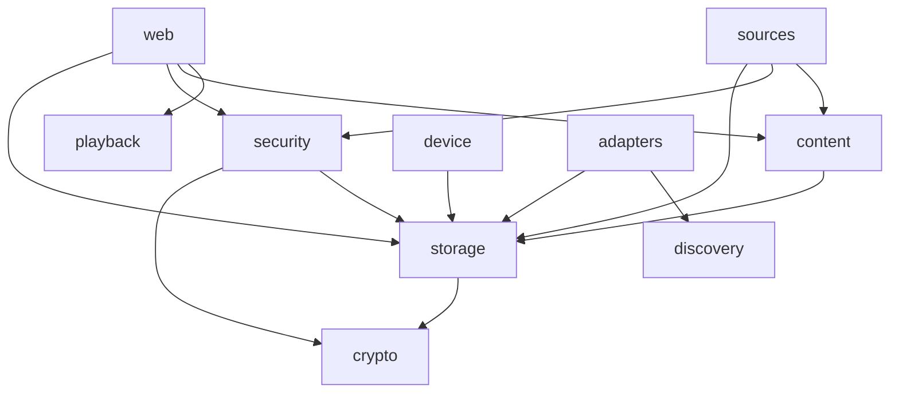

# Architecture

How the code is organised, the rules the build enforces on it, and how the architecture roadmap
([spec](../superpowers/specs/2026-09-27-architecture-roadmap-design.md)) is measured.

## Package map

All code lives under `dev.andre.homecontrol`, with `HomeControlApplication` and `HomeControlConfiguration` at its
root.

| Package | Holds |
| --- | --- |
| `config` | The configuration root (`HomeControlProperties`), the list of modules that can be switched off (`Module`, `@ConditionalOnModule`), `SetupSection`, which a module extends to add its section (template `fragments/<id>-setup`) to the setup page, `Json`, the one JSON mapper the application's own code uses (it refuses nesting deeper than 64 levels; device protocols in `adapters` keep their own), and `LegacyPropertyNames`, which keeps renamed configuration keys working. |
| `core` | The domain model every other package builds on: devices, actions and device states, the adapter contract (`DeviceAdapter`, `DeviceHandle`, and `AdapterDiscovery` for adapters that find devices on the network), capabilities (what an adapter declares its sessions carry out; each action names the ones that can carry it), connection features found with `DeviceHandle.feature` (`InputListing`, `GroupListing`, `ReceiverApps`), and what the rest of the application may ask of devices (`DeviceQueries`, `DeviceCommands`, `DeviceEnrollment`, `DeviceSettings`). `core.content` holds content sources, items and rails. `core.playback` holds the references every source shares, the five device routes, the open extension points `SourceRef` and `DelegatedRoute` that sources implement, and the playback planner with its preference ladder (`Rung`). It is the Gradle module `core`, which depends only on the JDK. |
| `device` | The known devices, their connections and state, merging what discovery finds, and sending commands to a device's adapters. `Devices.assemble` wires one collaborator per job: `RegisteredDevices` answers queries, `CommandRouter` sends commands, `Enrollment` adds, merges, splits and forgets devices, `AdapterSettingsStore` keeps Wake-on-LAN and learned settings, and `DeviceConnections` holds one handle per device and adapter. `DeviceMatching` holds the pure rules that decide which device a discovered one belongs to. Enrollment decides under one registry lock, but resolves host names before it and connects and publishes events after it. At startup it lets each adapter check and bring up to date its own settings (`DeviceAdapter.validate`, `migrate`). `HomeControlConfiguration` exposes the four `core` interfaces as beans; nothing else outside `device` depends on it. `JsonFileDeviceRegistry` stores the paired devices in `devices.json`. |
| `adapters` | One package per device protocol: `androidtv`, `cast`, `webos`, `tizen`, `upnp`, `sonos`, `bluetooth`. Each is a module that can be switched off, with its wire protocol in a `protocol` subpackage (Bluetooth's BlueZ and mpv code sits behind interfaces instead). `adapters.net` (TLS, WebSockets, Wake-on-LAN, device URLs), `adapters.links` (content ids in service links) and `adapters.support` (the sessions' lifecycle toolkit: `StatePublisher`, `SessionLoop`, `Backoff`, `ConnectionSlot`, `Reconnector`, `ReconnectingPoller`; `DeviceCalls`, which turns protocol failures into core exceptions; `WakeOnLanPower`, `LearnedMac`, `PlayPauseToggle` and `SessionRegistry`, which the TV and speaker adapters share; the renderer helpers Sonos and UPnP share; and TV pairing keys kept as device secrets) are shared. |
| `discovery` | mDNS and SSDP discovery. SSDP's wire code (the datagram parser, the safe description fetch and the description parser), which the Sonos and UPnP protocols share, is the protocol package `discovery.ssdp.protocol`. Both start listening once the application is ready, so every listener of a `DeviceDiscoveredEvent` exists before the first one is published. |
| `sources` | One package per content source: `jellyfin`, `youtube`, `tmdb`, `sports`, `pinned`, `workflows`. Each is a module that can be switched off. A source that plays through its own references declares them, their routes and its route strategy in its package, and runs a content service's playback API with a `RouteExecutor`; see [ADR 0004](../adr/0004-device-control-from-sources.md). `sources.http` is shared: `GuardedHttpClient`, the one way a source reaches the network (pinned to the addresses `OutboundAddressPolicy` approves, one deadline, a body cap, failures that name only the host), and `HttpUrls`, the one parser for outbound links; see [ADR 0005](../adr/0005-outbound-http-for-content-sources.md). Inside `sports`, the feeds (`calendar`, `thesportsdb`) build on `sports.feed` (the `SportsFeed` contract, `FeedResult`, `FeedFetches`) and `sports.settings`, and only calendars use `sports.ics`, a parser that depends on the JDK alone; ArchUnit keeps these layers. |
| `content` | The rail cache, search across sources, and source preferences. |
| `playback` | `PlaybackService`, which plans a route for an item on a device, carries it out and reports the outcome, and the deep-link test. |
| `web` | Controllers, view models and the event stream behind the dashboard and setup pages. The setup page lists the devices and content sources sections of whichever modules are on, from their `SetupSection` beans, and every page shares its head, header and first-password fields from `templates/fragments/layout.html`. No page carries script of its own: each page's code is in its ES module under `static/js`. `ErrorAdvice` answers every controller's core exceptions with one status and a plain-text body, for example 404 for an unknown device. `EventStream` sends each open tab device state, rail updates and rail lists over server-sent events, with a heartbeat comment so a reverse proxy keeps a quiet stream open. |
| `security` | Login, the host allowlist, cross-origin protection and the security headers, among them a Content-Security-Policy that allows scripts only from this server. A controller that needs the login takes a `LoginContext` argument and passes it on; `LoginService` and services and stores decide with it, so nothing outside the web edge reads the HTTP request or session. |
| `storage` | The data directory, the one writer for its files (`AtomicFiles`), the versioned JSON files the stores hold (`VersionedJsonFile`), the encrypted secret store and its key, and source settings. See [ADR 0002](../adr/0002-versioned-data-files-and-device-secrets.md). |
| `crypto` | Argon2id hashing for the login password and the secret key. |

## Modules

The build has two Gradle projects. Each compiles against only what its build file declares, so the compiler refuses an
import that crosses a module's boundary. That holds only for the classes inside the module, so `ArchitectureTest` and
`TestArchitectureTest` check that no class or test of package `core` sits in the app.

| Module | Directory | Holds | Depends on |
| --- | --- | --- | --- |
| `core` | `core/` | the package `core` | the JDK |
| app | the repository root | every other package; it builds the boot jar | `core`, Spring Boot and the libraries in `build.gradle.kts` |

What every project shares (Java 25, Maven Central, JaCoCo, the JUnit platform, the checksum task) is in the
`allprojects {}` block of the root `build.gradle.kts`. A module compiles with `-parameters`, as Spring Boot's plugin
compiles the app, and its jar is named `home-control-<module>`. One JaCoCo report,
`build/reports/jacoco/testCodeCoverageReport/testCodeCoverageReport.xml`, covers every module's classes with every
module's tests, because the app's tests exercise much of `core`; SonarCloud reads it for every module. Why the root
project stays the app: [ADR 0006](../adr/0006-gradle-modules.md).

## Dependencies

The dependencies between the top-level packages that the code has and the rules allow. Every package may also depend
on `core`, which depends on nothing, and on `config`, the configuration root; those arrows are left out.

No top-level package depends on `device`. Only the application's configuration in the root package does: it
assembles the device package and exposes the four `core` device interfaces as beans, through which every other
package sees devices.

## Package rules

`src/test/java/dev/andre/homecontrol/ArchitectureTest.java` checks these rules on every build, except one whose status
names a module: the compiler enforces it, and `ArchitectureTest` checks that the package lives in that module alone.

| Rule | Status |
| --- | --- |
| `core` depends only on the JDK | the `core` module: nothing else is on its classpath |
| Content sources are independent of each other, apart from the shared `sources.http` | strict |
| Device adapters are independent of each other, apart from the shared `adapters.net`, `adapters.links` and `adapters.support`, and Sonos and `adapters.support` using `adapters.upnp.protocol` | strict |
| `java.net.http`, Apache HttpClient 5, jmDNS and D-Bus are used only in `adapters`, `sources` and `discovery` | strict |
| Inside `sources`, only `sources.http` uses `java.net.http` or Apache HttpClient 5 | strict |
| Outside `adapters`, only `config` builds a `JsonMapper` | strict |
| Nothing outside `device` depends on it, except the application's configuration (`HomeControlConfiguration`): callers use the four `core` device interfaces | strict |
| `jakarta.servlet` is used only in `web`, `security`, controllers and controller advice | strict |
| Classes named `*Session` in `adapters` create no executors: their thread is a `SessionLoop` | strict |
| `..protocol..` packages depend on neither Spring nor any application package other than `adapters.net` and other protocol packages | strict |
| No cycles between the top-level packages | strict |
| `sources` does not depend on `adapters` | strict |
| `adapters` depends on neither `sources` nor `web` | strict |
| `web` does not depend on `adapters` | strict |

A protocol class reports a failed exchange with an `IOException`: a `DeviceTimeoutException` when the device did not
answer in time, a `DeviceRefusedException` when it answered no, with the device's reason. A parser of received data
may throw `IllegalArgumentException` for input it cannot read; its caller decides what that means. Sessions turn
both into core exceptions through `DeviceCalls`, and pairing services into pairing results.

`core`'s tests sit in the `core` module and compile against `core` alone;
`src/test/java/dev/andre/homecontrol/TestArchitectureTest.java` keeps the app's tests out of package `core`. A
source's own types are tested in its module; tests that need every module, such as the route keys and the application's preference ladder, sit in
`playback`.

## Progress measures

The roadmap's measures, updated by each workstream that moves them.

| Measure | Baseline (2026-09-27) | Now |
| --- | --- | --- |
| Frozen ArchUnit violations | 89 | 0 (every rule strict) |
| Largest class | 813 lines (`DeviceManager`) | 453 lines (`Enrollment`) |
| HTTP request loops in content sources | 6 | 1 (`GuardedHttpClient`) |
| `JsonMapper` builders | 20 | 5 (`config.Json` and four adapter mappers) |
| Summed test-class time | 495 s (one JVM) | 320 s (one JVM), 569 s (four JVMs) |
| `test` task wall time | not measured | 3 min 27 s (four JVMs, 4 CPUs) |
| Spring context starts per test run | 67 (one JVM) | 22 (four JVMs: 7, 7, 5, 3) |
| CI "Build and test" job time | about 9 min | 3 min 45 s |
| Wall-clock upper-bound assertions | 9 | 1 |
| Copies of `MutableClock` | 5, one of them nested in `SsdpDiscoveryTest` | 1 |
| Clean `build` | not measured | 4 min 5 s (4 min 8 s before `core` was a module) |
| `build` after a change to one app class | not measured | 3 min 40 s (3 min 48 s before `core` was a module) |
| `build` after a change to one `core` class | not measured | 3 min 42 s (3 min 52 s before `core` was a module) |

Since #117 the unit tests run in up to four JVMs at once. Summed class time and context starts count all of them, and
a class takes longer while it shares the CPUs, so compare runs with the same number of JVMs.

Context starts are Spring Boot's `Started …` log lines in the test results, nested test classes included. The 43
recorded before Phase 1.3d-3 left out two nested ones. Each JVM now starts one web slice, one modules-off context and
one full-application context. The rest are the nine tests listed in `SharedContextRulesTest.OWN_CONTEXT` and
`BluetoothClassLoadingTest`, which starts the application in a JVM of its own. The `test` task's wall time did not fall
with the context starts.

The nine counted at the baseline are now outcome assertions. `EventStreamShutdownEndToEndTest`, added since, keeps
its bound, because the elapsed time of closing the application is the behaviour it tests.

`YouTubeEndToEndTest` took about 13 s: 4.7 s of Spring context start, 3.2 s of certificate generation and a real Cast
connect before its first request, and 4.7 s for the rest of the journey, about 2–3 s of it OAuth polling at the
production floor of one poll a second. Since Phase 1.3d-3 it shares the full-application context and takes 3.6 s in a
one-JVM run.

The build times are the median of three runs of `scripts/gradle.sh` on the same four-CPU machine, without the build
cache. A change moves every line number of `web/ErrorAdvice.java` or `core/Device.java`, so the class file changes
and no signature does. The roadmap splits the app further only if these numbers show that it would pay. So far the
app's `test` task, which runs again after any change to the app or to a module it uses, takes most of every build.
