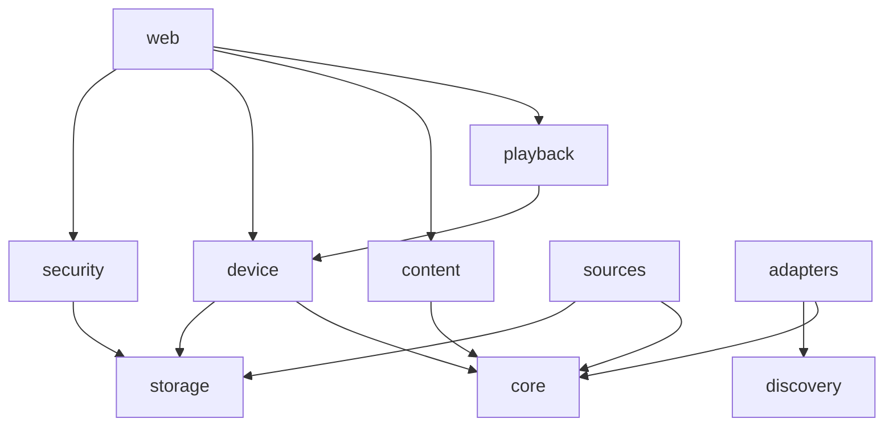

# Phase 1.2 Documentation Implementation Plan

> **For agentic workers:** REQUIRED SUB-SKILL: Use superpowers:subagent-driven-development (recommended) or superpowers:executing-plans to implement this plan task-by-task. Steps use checkbox (`- [ ]`) syntax for tracking.

**Goal:** Split the 826-line README into a short overview plus user and developer guides, add `AGENTS.md`, give ADRs a home and archive merged plans, without losing or rewording any existing text.

**Architecture:**
- A throwaway script moves every README `##` section, word for word, to its target page by its exact heading. A heading the script does not know stops it, so nothing is lost silently.
- It also rewrites relative links for the new location.
- Two more throwaway scripts check the result: every line of the old README still exists somewhere, and every relative link and `#anchor` resolves.
- The only new prose is the README overview, the page titles and intros, the developer pages' framing text, `docs/dev/architecture.md`'s new sections, the ADR index and `AGENTS.md`.

**Tech Stack:** Markdown (GitHub rendering, Mermaid), Python 3 for the throwaway scripts, Gradle through `scripts/gradle.sh` for the tests that reference the Bluetooth guide.

**Spec:** `docs/superpowers/specs/2026-09-27-phase-1-guardrails-design.md`, section "1.2 Documentation (M)".

## Global Constraints

- **Start condition.** Start only when #118 (CI rework), #119 (Phase 1 spec) and #120 (ArchUnit) are merged; check with `gh pr view <n> --json state`. Branch `docs/phase-1-2-docs` from `origin/main`. #118 rewrites parts of the README and `ci.yml`, and #120 creates `docs/dev/architecture.md`, which Task 3 extends.
- **Sections move word for word.** The exceptions are exactly these:
  - heading levels, where a section's heading becomes a page title or a subsection is promoted;
  - relative link targets, recomputed for the new location;
  - the cross-references rewritten in Task 2 Step 4.
- **Production behaviour does not change.** The one exception is the path of the Bluetooth host guide, which four messages and the setup page show to users.
- Build and test only through `scripts/gradle.sh`; there is no local JDK. `scripts/gradle.sh build` is green at the end.
- The helper scripts in this plan are saved under the scratchpad directory, not in the repository, and never committed.
- Commits use conventional-commit style and end with a `Co-Authored-By:` trailer naming the model that wrote them.

## Review Focus

- **A README section added after this plan was written must not vanish.** #118 or later PRs may add a `##` heading this plan does not map. The split script exits and names it (Task 2 Step 2), and the preservation check (Task 2 Step 6) lists any old line found nowhere.
- **Links into moved text from the rest of the repository must still resolve.** Examples are `README.md#…` anchors and links to the Bluetooth guide, the Cast ADR and archived plans. The link check (Task 2 Step 7, Task 3 Step 6, Task 4 Step 6, Task 5 Step 3) runs over every Markdown file that links into the new pages. Task 4 Step 5 replaces the old paths repository-wide.
- **Relative links inside moved sections must work from their new directory.** For example, the streaming-launchers acceptance review linked from the sources guide. The split script recomputes them, and the link check proves it.
- **People who arrive from an old README anchor must find the section.** The README's "Documentation" section says that every former section lives on one of the guide pages under the same heading, and names the pages (Task 2 Step 3).
- **The Bluetooth guide path shown to users must match where the guide lives.** Task 1's tests pin the path in the failure messages, on the setup page, and in the deployment test that reads the file.

---

### Task 1: Move the Bluetooth host guide to `docs/user/`

`docs/bluetooth-speakers.md` is referenced by path from:
- production messages and comments: `BluetoothHostChecks`, `BluezFailures`, `BluetoothSpeakerSession`, `BluetoothProperties`;
- the setup page template;
- `application.yaml`, both Compose files and `ci.yml`;
- the README;
- three tests: one reads the file, two assert the path in messages.

**Files:**
- Modify (tests first): `src/test/java/dev/andre/homecontrol/deployment/BluetoothDeploymentTest.java` (two `Path.of("docs/bluetooth-speakers.md")`), `src/test/java/dev/andre/homecontrol/adapters/bluetooth/bluez/BluezFailuresTest.java` (two `contains("docs/bluetooth-speakers.md")`), `src/test/java/dev/andre/homecontrol/web/BluetoothSetupControllerTest.java` (one `containsString("docs/bluetooth-speakers.md")`)
- Move: `docs/bluetooth-speakers.md` → `docs/user/bluetooth-speakers.md`
- Modify: every other file `git grep -l 'docs/bluetooth-speakers.md'` lists outside `docs/superpowers/`

**Interfaces:**
- Consumes: nothing.
- Produces: `docs/user/bluetooth-speakers.md`, which Task 2's devices guide links to as `bluetooth-speakers.md`.

- [ ] **Step 1: Point the tests at the new path**

```bash
sed -i 's|docs/bluetooth-speakers.md|docs/user/bluetooth-speakers.md|g' \
  src/test/java/dev/andre/homecontrol/deployment/BluetoothDeploymentTest.java \
  src/test/java/dev/andre/homecontrol/adapters/bluetooth/bluez/BluezFailuresTest.java \
  src/test/java/dev/andre/homecontrol/web/BluetoothSetupControllerTest.java
git diff --stat
```

Expected: 3 files changed, 5 lines.

- [ ] **Step 2: Run the tests to verify they fail**

Run: `scripts/gradle.sh test --tests 'dev.andre.homecontrol.deployment.BluetoothDeploymentTest' --tests 'dev.andre.homecontrol.adapters.bluetooth.bluez.BluezFailuresTest' --tests 'dev.andre.homecontrol.web.BluetoothSetupControllerTest'`

Expected: FAIL.
- `BluetoothDeploymentTest` fails with `NoSuchFileException: docs/user/bluetooth-speakers.md`.
- The other two fail because the messages and the page still say `docs/bluetooth-speakers.md`.

- [ ] **Step 3: Move the guide and update every reference**

```bash
mkdir -p docs/user
git mv docs/bluetooth-speakers.md docs/user/bluetooth-speakers.md
git grep -l 'docs/bluetooth-speakers.md' -- ':!docs/superpowers' | xargs sed -i 's|docs/bluetooth-speakers.md|docs/user/bluetooth-speakers.md|g'
git grep -n 'docs/bluetooth-speakers.md' -- ':!docs/superpowers'
```

Expected: the last command prints nothing. The files changed are those `git grep` found when this plan was written:
- `BluetoothHostChecks.java`, `BluezFailures.java`, `BluetoothSpeakerSession.java`, `BluetoothProperties.java`;
- `application.yaml` and `fragments/bluetooth-setup.html`;
- `compose.bluetooth.yaml` and `casaos/docker-compose.bluetooth.yml`;
- `.github/workflows/ci.yml` and `README.md`.

Archived plans under `docs/superpowers/` keep their historical text.

- [ ] **Step 4: Run the tests to verify they pass**

Run the command from Step 2.
Expected: PASS.

- [ ] **Step 5: Build and commit**

Run: `scripts/gradle.sh build`
Expected: BUILD SUCCESSFUL.

```bash
git add -A docs/bluetooth-speakers.md docs/user/bluetooth-speakers.md
git add src/main src/test compose.bluetooth.yaml casaos/docker-compose.bluetooth.yml .github/workflows/ci.yml README.md
git commit -m "docs: move the Bluetooth host guide to docs/user

The setup page, the Bluetooth failure messages and the Compose files now
point at docs/user/bluetooth-speakers.md."
```

End the message with your `Co-Authored-By:` trailer.

### Task 2: User guides and the short README

The split, by exact `##` heading of the current README:

| README section | Goes to |
| --- | --- |
| `# Home Control` (title and intro) | rewritten in the new README |
| `## Running`, `## Running a prebuilt image`, `## CasaOS`, `## License` | stay in the README, word for word |
| `## Pairing`, `## On your phone`, `## Opening links on a device`, `## Cast devices`, `## Smart TVs (LG webOS, Samsung Tizen)`, `## Wi-Fi speakers (DLNA/UPnP and Sonos)`, `## Bluetooth speakers (optional)`, `## Discovery does not work` | `docs/user/devices.md` |
| `## Content sources and login` (all subsections except `### Secrets`), `## Sport and DAZN` | `docs/user/sources.md` |
| `### Secrets` (promoted to `## Secrets`) | `docs/user/security.md` |
| `## Configuration` | `docs/user/configuration.md` (its heading becomes the page title) |
| `## Security` | `docs/user/security.md` (its heading becomes the page title) |
| `## Browser tests` | `docs/dev/testing.md` |
| `## CI quality gate`, `## Releases` | `docs/dev/ci-and-releases.md` |

The new README also gets a short, newly written `## Security` pointer.

**Files:**
- Create: `docs/user/devices.md`, `docs/user/sources.md`, `docs/user/configuration.md`, `docs/user/security.md`, `docs/dev/testing.md`, `docs/dev/ci-and-releases.md`
- Modify: `README.md`

**Interfaces:**
- Consumes: `docs/user/bluetooth-speakers.md` (Task 1).
- Produces: the six pages, each starting with a `# Title` line and a one-paragraph intro. Task 3 adds sections to `docs/dev/testing.md` and `docs/dev/ci-and-releases.md` directly after their intro and before the moved sections.

- [ ] **Step 1: Save the helper scripts**

Save as `<scratchpad>/split-readme.py`:

```python
#!/usr/bin/env python3
"""Moves README sections, word for word, to the documentation pages by their exact '## ' heading.

Usage: split-readme.py OLD_README  (run from the repository root; writes README.md and the pages)
"""
import os
import re
import sys

PAGES = {
    "docs/user/devices.md": ("Devices", "Pairing and using the devices Home Control controls. Bluetooth speakers have "
                             "their own guide: [Bluetooth speakers](bluetooth-speakers.md)."),
    "docs/user/sources.md": ("Content sources", "Connecting the services Home Control plays from, and the login that "
                             "protects them."),
    "docs/user/configuration.md": ("Configuration", "Every setting, as a Spring property or an environment variable."),
    "docs/user/security.md": ("Security", "What Home Control protects, and how."),
    "docs/dev/testing.md": ("Testing", "How the test suites are built and how to run them."),
    "docs/dev/ci-and-releases.md": ("CI and releases", "What runs on every push and pull request, and how releases "
                                    "are made."),
}
TARGETS = {
    "Pairing": "docs/user/devices.md",
    "On your phone": "docs/user/devices.md",
    "Opening links on a device": "docs/user/devices.md",
    "Cast devices": "docs/user/devices.md",
    "Smart TVs (LG webOS, Samsung Tizen)": "docs/user/devices.md",
    "Wi-Fi speakers (DLNA/UPnP and Sonos)": "docs/user/devices.md",
    "Bluetooth speakers (optional)": "docs/user/devices.md",
    "Discovery does not work": "docs/user/devices.md",
    "Content sources and login": "docs/user/sources.md",
    "Sport and DAZN": "docs/user/sources.md",
    "Configuration": "docs/user/configuration.md",
    "Security": "docs/user/security.md",
    "Browser tests": "docs/dev/testing.md",
    "CI quality gate": "docs/dev/ci-and-releases.md",
    "Releases": "docs/dev/ci-and-releases.md",
}
KEPT = ["Running", "Running a prebuilt image", "CasaOS", "License"]


def sections(text):
    """Splits into (heading, lines) at '## ' headings; the part before the first one has heading None."""
    parts, heading, lines = [], None, []
    for line in text.splitlines():
        if line.startswith("## "):
            parts.append((heading, lines))
            heading, lines = line[3:].strip(), [line]
        else:
            lines.append(line)
    parts.append((heading, lines))
    return parts


def relink(lines, page):
    """Recomputes relative link targets (written from the repository root) for a page's directory."""
    folder = os.path.dirname(page)
    pattern = re.compile(r"\]\((?![a-z]+:|#)([^)\s]+)\)")
    return [pattern.sub(lambda m: "](" + os.path.relpath(m.group(1), folder) + ")", line) for line in lines]


def split_out_secrets(lines):
    """Takes '### Secrets' (up to the next '### ') out of a section, promoted to '## Secrets'."""
    start = next(i for i, line in enumerate(lines) if line.strip() == "### Secrets")
    end = next((i for i in range(start + 1, len(lines)) if lines[i].startswith("### ")), len(lines))
    secrets = ["## Secrets"] + lines[start + 1:end]
    return lines[:start] + lines[end:], secrets


def main(old_readme):
    parts = sections(open(old_readme, encoding="utf-8").read())
    known = set(TARGETS) | set(KEPT)
    unknown = [h for h, _ in parts if h is not None and h not in known]
    if unknown:
        sys.exit("No target for README section(s): " + ", ".join(unknown) + ". Add them to TARGETS or KEPT.")
    bodies = {page: [] for page in PAGES}
    kept = {}
    for heading, lines in parts:
        if heading is None:
            continue
        if heading in KEPT:
            kept[heading] = lines
            continue
        page = TARGETS[heading]
        if heading == "Content sources and login":
            lines, secrets = split_out_secrets(lines)
            bodies["docs/user/security.md"].append(("Secrets", relink(secrets, "docs/user/security.md")))
        if heading == PAGES[page][0]:
            lines = lines[1:]  # the page title replaces the section's own heading
        bodies[page].append((heading, relink(lines, page)))
    # security.md: the former '## Security' text first, then '## Secrets'
    bodies["docs/user/security.md"].sort(key=lambda item: item[0] != "Security")
    for page, (title, intro) in PAGES.items():
        os.makedirs(os.path.dirname(page), exist_ok=True)
        body = "\n".join(line for _, lines in bodies[page] for line in lines).strip("\n")
        with open(page, "w", encoding="utf-8") as out:
            out.write(f"# {title}\n\n{intro}\n\n{body}\n")
    with open("kept-sections.md", "w", encoding="utf-8") as out:
        for heading in KEPT:
            out.write("\n".join(kept[heading]).strip("\n") + "\n\n")
    print("pages written; kept sections in kept-sections.md")


if __name__ == "__main__":
    main(sys.argv[1])
```

Save as `<scratchpad>/check-preserved.py`:

```python
#!/usr/bin/env python3
"""Lists lines of the old README that appear in none of the given files (ignoring heading marks and indentation).

Usage: check-preserved.py OLD_README FILE...
"""
import re
import sys


def norm(line):
    return re.sub(r"^#+\s*", "", line).strip()


old = open(sys.argv[1], encoding="utf-8").read().splitlines()
present = {norm(line) for name in sys.argv[2:] for line in open(name, encoding="utf-8").read().splitlines()}
missing = [(n, line) for n, line in enumerate(old, 1) if norm(line) and norm(line) not in present]
for n, line in missing:
    print(f"{n}: {line}")
print(f"{len(missing)} line(s) of the old README not found verbatim", file=sys.stderr)
```

Save as `<scratchpad>/check-links.py`:

```python
#!/usr/bin/env python3
"""Checks that relative links and #anchors in the given Markdown files resolve. Exit 1 on any broken link.

Usage: check-links.py FILE...
"""
import pathlib
import re
import sys


def slug(heading):
    text = re.sub(r"[^\w\- ]", "", heading.strip().lower())  # GitHub keeps letters, digits, _, - and spaces
    return text.replace(" ", "-")


def anchors(path):
    text = re.sub(r"```.*?```", "", path.read_text(encoding="utf-8"), flags=re.S)
    return {slug(re.sub(r"^#+\s*", "", line)) for line in text.splitlines() if line.startswith("#")}


broken = 0
for name in sys.argv[1:]:
    path = pathlib.Path(name)
    text = re.sub(r"```.*?```", "", path.read_text(encoding="utf-8"), flags=re.S)
    for target in re.findall(r"\]\(([^)\s]+)\)", text):
        if re.match(r"[a-z]+:", target):
            continue
        file_part, _, anchor = target.partition("#")
        dest = (path.parent / file_part).resolve() if file_part else path.resolve()
        if not dest.exists():
            print(f"{name}: missing file {target}")
            broken += 1
        elif anchor and dest.suffix == ".md" and anchor not in anchors(dest):
            print(f"{name}: no heading for {target}")
            broken += 1
sys.exit(1 if broken else 0)
```

- [ ] **Step 2: Split the README**

```bash
git show HEAD:README.md > <scratchpad>/old-readme.md
python3 <scratchpad>/split-readme.py <scratchpad>/old-readme.md
```

Expected: `pages written; kept sections in kept-sections.md`.

If it exits with "No target for README section(s): …", the section is new since this plan was written. Add it to `TARGETS` next to the section closest in topic, record a ruling, and run again.

- [ ] **Step 3: Write the new README**

Replace `README.md` with the text below, pasting the four kept sections word for word from `kept-sections.md` where marked:

```markdown
# Home Control

A web app for your home network that brings your devices and your media together on one page. It finds your TVs,
streaming boxes and speakers, shows what they are playing, gives each one a remote, and plays what you pick on the
device you choose.

- **Devices:** NVIDIA Shield and other Android TV / Google TV devices, Google Cast receivers, LG webOS and Samsung
  Tizen TVs, DLNA/UPnP and Sonos speakers, and Bluetooth speakers attached to the host.
- **Content:** Jellyfin, YouTube, trending titles from TMDB, sport fixtures from calendars and TheSportsDB, pinned
  links, and dynamic workflows that turn a JSON API into tiles you can play. Netflix, Prime Video and DAZN titles open
  in their own apps.
- **One container on your LAN:** Docker Compose or CasaOS, a phone-friendly web app, no cloud service. Connecting a
  content source adds a login password.

<the "## Running" section from kept-sections.md>

<the "## Running a prebuilt image" section from kept-sections.md>

<the "## CasaOS" section from kept-sections.md>

## First steps

1. Open `http://<host>:8080` and go to **Setup**. Devices on your network show up there; pair each one as
   [Pairing](docs/user/devices.md#pairing) describes.
2. On your phone, add the page to the home screen: see [On your phone](docs/user/devices.md#on-your-phone).
3. Connect content sources on the setup page: see
   [Content sources and login](docs/user/sources.md#content-sources-and-login). The first one asks you to set a login
   password.

## Documentation

Every section this README used to hold now lives in one of these pages, under the same heading.

**Using Home Control** (`docs/user/`):
- [Devices](docs/user/devices.md): pairing, the phone app, opening links, Cast devices, smart TVs, Wi-Fi and Bluetooth
  speakers, discovery problems.
- [Bluetooth speakers](docs/user/bluetooth-speakers.md): host requirements and every failure mode's fix.
- [Content sources](docs/user/sources.md): login, dynamic workflows, Jellyfin, play routes, Netflix, Prime Video and
  DAZN, YouTube, sport.
- [Configuration](docs/user/configuration.md): every property and environment variable.
- [Security](docs/user/security.md): what is protected, secrets, reverse proxies.

**Working on Home Control:**
- [AGENTS.md](AGENTS.md): how to build and test, and the rules every change follows.
- [Architecture](docs/dev/architecture.md), [Testing](docs/dev/testing.md) and
  [CI and releases](docs/dev/ci-and-releases.md).
- [Architecture decisions](docs/adr/README.md).

## Security

A deployment with only devices has no login: anyone who can reach the port can control them. Do not expose Home
Control to the internet without an authenticating reverse proxy in front of it. [Security](docs/user/security.md) has
the details.

<the "## License" section from kept-sections.md>
```

Then delete `kept-sections.md` from the repository root.

(`AGENTS.md`, `docs/adr/README.md` and the new architecture sections are created in Tasks 3–5. The link check in Step 7 reports those three links as missing until then; every other link must resolve.)

- [ ] **Step 4: Turn the "above/below" cross-references into links**

The moved text points at other sections by name, with "above" or "below". Find them all:

```bash
grep -n -E '"[A-Z][^"]*"( |$)' docs/user/*.md docs/dev/*.md | grep -E -i 'above|below|see "' ; grep -n -B1 -E '^below\)' docs/user/*.md
```

Replace each with a link to where that section now lives. When this plan was written there were these:

| In | Text | Becomes |
| --- | --- | --- |
| `devices.md` | `see "Opening links on a device" below` | `see [Opening links on a device](#opening-links-on-a-device)` |
| `devices.md` | ``See `docs/user/bluetooth-speakers.md` for`` | `See [Bluetooth speakers](bluetooth-speakers.md) for` |
| `sources.md` | `(see "Docker-networked Jellyfin" below)` | `(see [Docker-networked Jellyfin](#docker-networked-jellyfin))` |
| `sources.md` | `(see "Secrets"` + line break + `below)` | `(see [Secrets](security.md#secrets))` |
| `sources.md` (YouTube → Privacy) | `(see "Secrets" below)` | `(see [Secrets](security.md#secrets))` |
| `security.md` | `(see "Configuration" below)` | `(see [Configuration](configuration.md))` |
| `security.md` | `(see "Content sources` + line break + `and login" above)` | `(see [Content sources and login](sources.md#content-sources-and-login))` |

Rewrap a paragraph only where a replacement leaves a line over 110 characters.

"Above" and "below" that point within the same section stay as they are: "the flow above", "rung 1 above", "the session links below them", "see below".

- [ ] **Step 5: Check the headings**

```bash
grep -n '^#' docs/user/*.md docs/dev/testing.md docs/dev/ci-and-releases.md
```

Expected:
- Each page starts with exactly one `# ` title.
- `security.md` has `## Secrets` after the former Security text.
- `configuration.md` has no `## Configuration`, and `security.md` has no `## Security`.
- Everything else keeps its original level.

- [ ] **Step 6: Check nothing was lost**

```bash
python3 <scratchpad>/check-preserved.py <scratchpad>/old-readme.md README.md docs/user/*.md docs/dev/*.md
```

Expected: only these kinds of lines are listed:
- the old title intro (the 4 lines after `# Home Control`);
- lines that Step 4 changed;
- lines whose relative link Step 2 recomputed (the streaming-launchers review link).

Read every listed line and confirm it falls into one of these. Any other line is lost text: put it back where it belongs.

- [ ] **Step 7: Check the links**

```bash
python3 <scratchpad>/check-links.py README.md docs/user/*.md docs/dev/*.md
```

Expected: only `README.md: missing file AGENTS.md` and `README.md: missing file docs/adr/README.md`, which Tasks 4 and 5 create. Nothing else.

- [ ] **Step 8: Commit**

```bash
git add README.md docs/user docs/dev/testing.md docs/dev/ci-and-releases.md
git commit -m "docs: split the README into user and developer guides

Every README section moves word for word to docs/user or docs/dev under
its own heading; the README keeps how to run Home Control and gains an
overview, first steps and a map of the guides."
```

End the message with your `Co-Authored-By:` trailer.

### Task 3: Developer guides and the architecture page

**Files:**
- Modify: `docs/dev/testing.md`, `docs/dev/ci-and-releases.md` (add text before the moved sections)
- Modify: `docs/dev/architecture.md` (from #120; replace its first paragraph, add three sections)
- Modify: `docs/superpowers/specs/2026-09-16-home-control-center-concept.md` (one note in §7)

**Interfaces:**
- Consumes: the pages from Task 2; `docs/dev/architecture.md` as #120 merged it (title, a "Phase 1.2 … extends this page" paragraph, `## Package rules`, `## Frozen violations`).
- Produces: `docs/dev/architecture.md` sections `## Package map`, `## Dependencies`, `## Package rules`, `## Frozen violations`, `## Progress measures`. `AGENTS.md` (Task 5) links to `docs/dev/architecture.md#frozen-violations` and `docs/dev/testing.md#running-tests`.

- [ ] **Step 1: Frame the testing guide**

In `docs/dev/testing.md`, insert directly after the intro paragraph (before `## Browser tests`):

```markdown
## Test layers

| Layer | What it is | Where |
| --- | --- | --- |
| Unit tests | Plain JUnit 5 with AssertJ, Mockito and Awaitility. Most device and source tests drive the real client against an in-process fake that speaks the real protocol over a socket. | `src/test/java`, next to the code |
| Web slices | `@WebMvcTest` of one controller with its collaborators mocked. | `src/test/java/.../web` and the modules' setup packages |
| End to end | `@SpringBootTest` with the whole application and fake devices or services, over MockMvc or real HTTP. | classes named `*EndToEndTest` |
| Browser tests | Playwright driving the dashboard in Chromium and WebKit. | `src/e2e/java`, see [Browser tests](#browser-tests) |
| Architecture | ArchUnit package rules. | `ArchitectureTest`, see [Architecture](architecture.md#package-rules) |

When this page was written, the unit, slice, end-to-end and architecture tests numbered 2,667.

## Running tests

- Everything: `scripts/gradle.sh build`. It runs `./gradlew` in the `gradle:jdk25` Docker image, for machines without
  a JDK 25; with one, `./gradlew build` does the same.
- One class: `scripts/gradle.sh test --tests 'dev.andre.homecontrol.core.ActionTest'`.
- A failure's details: `grep -A20 '<failure' build/test-results/test/*.xml`.
- The unit tests run in up to four JVMs at once, and Gradle reuses the results of tasks whose inputs did not change,
  so a test that passed and was not touched is not run again.

## Fakes and fixtures

- A fake of a device or a service is named `Fake…` and sits in the test package of the code it fakes, for example
  `FakeCastReceiver` or `FakeJellyfinServer`. It speaks the real protocol, so the production client runs unchanged.
- Recorded API responses live in `src/test/resources/fixtures/<source>/`.
- Waiting for something asynchronous uses Awaitility (`await().atMost(...)`), never `Thread.sleep`. A fake may
  sleep to model a slow peer, with `@SuppressWarnings("java:S2925")` and a one-line reason.

## Test configuration

Spring tests load the production `src/main/resources/application.yaml` with `src/test/resources/config/application.yaml`
on top of it. The test file holds only what a test run must change: no LAN discovery, no real upstream APIs, short
timeouts, no scheduled rail refresh, and no secrets from the developer's environment. Add a key there only with a
comment saying why a test run needs it.
```

- [ ] **Step 2: Frame the CI guide**

In `docs/dev/ci-and-releases.md`, insert directly after the intro paragraph (before the first moved section) a `## Jobs` section. It lists every job in `.github/workflows/ci.yml` in file order, as a table with two columns:
- **Job:** the job's `name:` value.
- **What it does:** one sentence taken from the comment above the job, or from its steps if it has no comment.

List the jobs with:

```bash
grep -n -E '^  [a-z0-9-]+:$|^    name:|^    # ' .github/workflows/ci.yml
```

Write the section as:

```markdown
## Jobs

`.github/workflows/ci.yml` runs on every push to `main` and on every pull request.

| Job | What it does |
| --- | --- |
| <name> | <one sentence> |
```

Then read the moved `## CI quality gate` and `## Releases` against `ci.yml`, and correct any statement `ci.yml` no longer bears out: job names, which job builds or publishes what, and the order of the release steps. List each correction in your report.

- [ ] **Step 3: Extend the architecture page**

In `docs/dev/architecture.md`, replace the paragraph "Phase 1.2 of the architecture roadmap extends this page with the package map and a dependency diagram." with:

````markdown
How the code is organised, the rules the build enforces on it, and how the architecture roadmap
([spec](../superpowers/specs/2026-09-27-architecture-roadmap-design.md)) is measured.

## Package map

All code lives under `dev.andre.homecontrol`.

| Package | Holds |
| --- | --- |
| `core` | The domain model every other package builds on: devices, capabilities, actions and device states, and the adapter contract (`DeviceAdapter`, `DeviceHandle`). `core.content` holds content sources, items and rails; `core.playback` playable references, routes and the playback planner. It depends only on the JDK. |
| `device` | `DeviceManager`: the known devices, their connections and state, merging what discovery finds, and sending commands to a device's adapters. |
| `adapters` | One package per device protocol: `androidtv`, `cast`, `webos`, `tizen`, `upnp`, `sonos`, `bluetooth`. Each is a module that can be switched off, with its wire protocol in a `protocol` subpackage where it has one. `adapters.net` (TLS, WebSockets, Wake-on-LAN) and `adapters.links` (content ids in service links) are shared. |
| `discovery` | mDNS and SSDP discovery. |
| `sources` | One package per content source: `jellyfin`, `youtube`, `tmdb`, `sports`, `pinned`, `workflows`. Each is a module that can be switched off. `sources.http` is shared: HTTP clients that connect only to vetted addresses and bound response bodies in size and time. |
| `content` | The rail cache, search across sources, and source preferences. |
| `playback` | `PlaybackService`, which plans a route for an item on a device, carries it out and reports the outcome, and the deep-link test. |
| `web` | Controllers, view models and the server-sent event stream behind the dashboard and setup pages. |
| `security` | Login, the host allowlist, cross-origin protection and the security headers. |
| `storage` | The data directory, the encrypted secret store and its key, and source settings. |
| `crypto` | Argon2id hashing for the login password and the secret key. |

## Dependencies

The intended direction of dependencies. The frozen violations below are the known exceptions.


````

Then, at the end of the page, add:

```markdown
## Progress measures

The roadmap's measures, updated by each workstream that moves them.

| Measure | Baseline (2026-09-27) | Now |
| --- | --- | --- |
| Frozen ArchUnit violations | 89 | <frozen> |
| Largest class | 813 lines (`DeviceManager`) | <largest> |
| Summed test-class time | 495 s | <summed> |
| Spring context starts per test run | 67 | <contexts> |
| CI "Build and test" job time | about 9 min | <ci> |
```

Fill in the "Now" column from these commands:
- `<frozen>`: the frozen counts in the "Package rules" table above, added up.
- `<largest>`: `find src/main/java -name '*.java' | xargs wc -l | sort -rn | sed -n 2p`.
- `<summed>` and `<contexts>`: from a test run.

  ```bash
  scripts/gradle.sh test --rerun-tasks
  grep -ho 'testsuite name="[^"]*" tests="[0-9]*" skipped="[0-9]*" failures="[0-9]*" errors="[0-9]*" timestamp="[^"]*" hostname="[^"]*" time="[0-9.]*"' build/test-results/test/*.xml | sed -E 's/.*time="([0-9.]*)"/\1/' | awk '{s+=$1} END {printf "%.0f s\n", s}'
  grep -ho 'Started [A-Za-z0-9]* in [0-9.]* seconds' build/test-results/test/*.xml | wc -l
  ```

- `<ci>`: the "Build and test" job duration of the latest successful run on `main`.

  ```bash
  gh run list --branch main --workflow CI --status success --limit 1 --json databaseId --jq '.[0].databaseId'
  gh run view <id> --json jobs --jq '.jobs[] | select(.name == "Build and test") | "\(.startedAt) \(.completedAt)"'
  ```

- [ ] **Step 4: Point the concept document at the current package map**

In `docs/superpowers/specs/2026-09-16-home-control-center-concept.md`, directly under the heading `## 7. Architecture`, insert:

```markdown
> The package map in this section is the plan from 2026-09-16. The current one is in
> [docs/dev/architecture.md](../../dev/architecture.md#package-map).
```

- [ ] **Step 5: Render the diagram**

Paste the Mermaid block into https://mermaid.live, or preview the file on GitHub after pushing the branch. Check that it renders without a syntax error.

- [ ] **Step 6: Check the links and commit**

```bash
python3 <scratchpad>/check-links.py README.md docs/user/*.md docs/dev/*.md docs/superpowers/specs/2026-09-16-home-control-center-concept.md
```

Expected: only the two missing files from Task 2 Step 7.

```bash
git add docs/dev docs/superpowers/specs/2026-09-16-home-control-center-concept.md
git commit -m "docs: describe the test layers, the CI jobs and the package map

The testing and CI guides get their framing, the architecture page gains
the package map, the intended dependencies and the roadmap's progress
measures, and the concept document points to the current package map."
```

End the message with your `Co-Authored-By:` trailer.

### Task 4: ADR index and the plan archive

**Files:**
- Move: `docs/superpowers/specs/2026-09-16-cast-sender-adr.md` → `docs/adr/0001-cast-sender.md`
- Create: `docs/adr/README.md`
- Move: every plan in `docs/superpowers/plans/` whose work is merged, or merges with this branch (this plan included), to `docs/superpowers/archive/`
- Modify: everything `git grep` finds with the old paths, for example `CastTls.java` and `cast_channel.proto` (comments), the SonarCloud review documents, and the Google Cast acceptance review

**Interfaces:**
- Consumes: nothing from earlier tasks.
- Produces: `docs/adr/README.md`, which the README links to.

- [ ] **Step 1: Move the Cast ADR**

```bash
mkdir -p docs/adr
git mv docs/superpowers/specs/2026-09-16-cast-sender-adr.md docs/adr/0001-cast-sender.md
```

- [ ] **Step 2: Write the ADR index**

Create `docs/adr/README.md`:

```markdown
# Architecture decisions

One file per decision, numbered in order. A decision is recorded when it is hard to reverse or would surprise someone
reading the code: which library or protocol implementation to use, what a module may depend on, what a data format
promises. Superseded decisions stay, marked as such.

| # | Decision | Status | Date |
| --- | --- | --- | --- |
| [0001](0001-cast-sender.md) | Google Cast: an in-house minimal CASTV2 sender instead of a library | Accepted | 2026-09-16 |

New decisions copy the header of 0001 (date, status, context) and take the next number.
```

- [ ] **Step 3: Archive the merged plans**

List the plans, and the open pull requests whose work a plan might belong to:

```bash
ls docs/superpowers/plans/
gh pr list --state open --json number,title,headRefName
```

Every plan whose work is merged moves; so does this plan, whose work merges with this branch. Keep a plan in `plans/` only if an open pull request carries its work, and record the reason in your report.

```bash
mkdir -p docs/superpowers/archive
for plan in docs/superpowers/plans/*.md; do git mv "$plan" docs/superpowers/archive/; done
```

(If a plan stays, move the others one by one instead of with the loop.)

- [ ] **Step 4: Find every reference to the moved files**

```bash
git grep -n -e 'specs/2026-09-16-cast-sender-adr' -e 'superpowers/plans/2026-'
```

- [ ] **Step 5: Update the references**

Replace each path found in Step 4 with the new location, written the way the surrounding file writes paths:

| Old | New |
| --- | --- |
| `docs/superpowers/specs/2026-09-16-cast-sender-adr.md` (repository path) | `docs/adr/0001-cast-sender.md` |
| `../specs/2026-09-16-cast-sender-adr.md` (link from `docs/superpowers/reviews/`) | `../../adr/0001-cast-sender.md` |
| `docs/superpowers/plans/<file>` (repository path) | `docs/superpowers/archive/<file>` |

```bash
git grep -l 'docs/superpowers/specs/2026-09-16-cast-sender-adr.md' | xargs sed -i 's|docs/superpowers/specs/2026-09-16-cast-sender-adr.md|docs/adr/0001-cast-sender.md|g'
git grep -l '\.\./specs/2026-09-16-cast-sender-adr.md' | xargs sed -i 's|\.\./specs/2026-09-16-cast-sender-adr.md|../../adr/0001-cast-sender.md|g'
git grep -l 'docs/superpowers/plans/2026-' | xargs sed -i 's|docs/superpowers/plans/2026-|docs/superpowers/archive/2026-|g'
git grep -n -e 'specs/2026-09-16-cast-sender-adr' -e 'superpowers/plans/2026-'
```

Expected: the last command prints nothing. If a plan stayed in `plans/` (Step 3), restore its references by hand before continuing.

The roadmap spec's sentence that new plans go to `docs/superpowers/plans/` names the folder, not a file, so it is unaffected and stays true.

- [ ] **Step 6: Build, check the links and commit**

Run: `scripts/gradle.sh build`
Expected: BUILD SUCCESSFUL. Two code comments changed, including `cast_channel.proto`, from which code is generated.

```bash
python3 <scratchpad>/check-links.py README.md docs/user/*.md docs/dev/*.md docs/adr/*.md docs/superpowers/reviews/*.md docs/superpowers/specs/*.md
```

Expected: only `README.md: missing file AGENTS.md`, apart from links that were already broken before this branch. For every other broken link, check whether this branch caused it: run `git log origin/main..HEAD -S'<target>' --oneline`, and see whether the target was moved here. Fix the ones this branch caused. List the ones that were already broken in your report without fixing them.

```bash
git add -A docs/adr docs/superpowers src/main
git commit -m "docs: give architecture decisions a home and archive merged plans

The Cast sender ADR becomes docs/adr/0001, under an index, and every plan
whose work is merged moves to docs/superpowers/archive; references follow."
```

End the message with your `Co-Authored-By:` trailer.

### Task 5: `AGENTS.md` and `CLAUDE.md`

**Files:**
- Create: `AGENTS.md`, `CLAUDE.md`

**Interfaces:**
- Consumes: `docs/dev/testing.md#running-tests`, `docs/dev/architecture.md#frozen-violations` and `docs/dev/ci-and-releases.md` (Tasks 2–3), `docs/adr/README.md` (Task 4).
- Produces: nothing.

- [ ] **Step 1: Write `AGENTS.md`**

```markdown
# Working on Home Control

Rules for everyone who changes this repository, people and coding agents alike. The
[developer guides](docs/dev/) explain the architecture, the tests and CI in depth.

## Build and test

- There may be no local JDK. `scripts/gradle.sh <arguments>` runs `./gradlew` in the `gradle:jdk25` Docker image;
  use it wherever the documentation says `./gradlew`. See [Running tests](docs/dev/testing.md#running-tests).
- A change is done when `scripts/gradle.sh build` is green.
- Browser tests run with `scripts/e2e.sh`; see [Browser tests](docs/dev/testing.md#browser-tests).

## Stack

- Java 25, Spring Boot 4.1.1, Jackson 3 (packages `tools.jackson.*`). MockMvc's test auto-configuration is in
  `org.springframework.boot.webmvc.test.autoconfigure`.
- Thymeleaf, htmx, server-sent events and plain ES modules. No Node build and no frontend framework.

## Product rules

- **A LAN appliance.** One Docker container, run with Compose or CasaOS. No cloud service; HTTPS is a reverse
  proxy's job.
- **Commands are ephemeral.** A request that cannot be carried out now fails now, with a reason. Nothing is queued.
- **State is JSON under `/data`, written atomically.** Secrets are encrypted at rest and never reach the browser.
- **Existing installs upgrade in place.** A change to a `/data` format migrates the old format when it reads it.
- **Every device adapter and content source is a module that can be switched off**, with
  `home-control.<module>.enabled`.
- **Some names never change:**
  - configuration under `shield.*` and `SHIELD_KEYSTORE_PASSWORD` keeps working;
  - the CasaOS app id stays `dev.andre.shield-remote`;
  - the Android TV client package name sent to devices stays `dev.andre.shield`.

## Architecture rules

- Only adapters speak device protocols, and only sources speak content APIs. `ArchitectureTest` enforces the package
  rules; see [Architecture](docs/dev/architecture.md).
- Rules the code still breaks are frozen in `src/test/archunit-store`. When you fix a violation, commit the smaller
  store. Never refreeze. When a change only alters a frozen violation's text, replace its store line by hand; see
  [Frozen violations](docs/dev/architecture.md#frozen-violations).
- Decisions that are hard to reverse get an [architecture decision record](docs/adr/README.md).

## Where things live

- Device adapters: `src/main/java/dev/andre/homecontrol/adapters/<device>/`, with the wire protocol in `protocol/`.
- Content sources: `src/main/java/dev/andre/homecontrol/sources/<source>/`.
- Tests sit in the same package as the code they test. Fakes of devices and services are named `Fake…` and speak
  the real protocol; recorded API responses are in `src/test/resources/fixtures/<source>/`.
- Test configuration: `src/test/resources/config/application.yaml` holds only overrides of the production
  `application.yaml`.
- User guides are in `docs/user/`, developer guides in `docs/dev/`. Specs, plans and reviews of larger pieces of work
  are in `docs/superpowers/`.

## Commits and pull requests

- Commit messages follow [Conventional Commits](https://www.conventionalcommits.org): `feat:`, `fix:`, `refactor:`,
  `test:`, `docs:`, `build:`, `ci:`, `chore:`. Releases and the changelog are made from them; see
  [CI and releases](docs/dev/ci-and-releases.md).
- Pull requests follow `.github/pull_request_template.md`.
- Stage only the files you changed (`git add <paths>`, never `git add -A`); other work may be in progress in the same
  tree.
- A deliberate exception to a SonarCloud rule uses the narrowest `@SuppressWarnings("java:S…")` possible, with a
  one-line reason.
```

- [ ] **Step 2: Write `CLAUDE.md`**

```markdown
@AGENTS.md
```

- [ ] **Step 3: Check the links**

```bash
python3 <scratchpad>/check-links.py README.md AGENTS.md docs/user/*.md docs/dev/*.md docs/adr/*.md docs/superpowers/reviews/*.md docs/superpowers/specs/*.md
```

Expected: no output other than the links already broken before this branch that Task 4 Step 6 listed. `check-links.py` accepts a link to a directory when the directory exists, such as `docs/dev/`.

- [ ] **Step 4: Check the facts `AGENTS.md` states**

```bash
grep -n 'id: dev.andre.shield-remote' casaos/docker-compose.yml
grep -rn '"dev.andre.shield"' src/main/java | head -1
grep -n 'spring-boot = ' gradle/libs.versions.toml
ls scripts/gradle.sh scripts/e2e.sh .github/pull_request_template.md
```

Expected:
- each `grep` prints one match;
- the Spring Boot version is `4.1.1` (if it is newer, write that version into `AGENTS.md`);
- all four files exist.

- [ ] **Step 5: Build and commit**

Run: `scripts/gradle.sh build`
Expected: BUILD SUCCESSFUL.

```bash
git add AGENTS.md CLAUDE.md
git commit -m "docs: add AGENTS.md with the rules every change follows

How to build and test without a local JDK, the stack, the product and
architecture rules, where things live, and the commit and pull request
conventions. CLAUDE.md imports it."
```

End the message with your `Co-Authored-By:` trailer.
