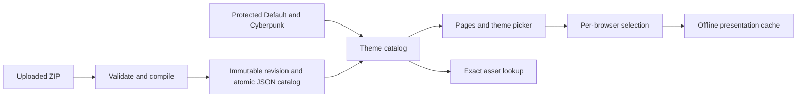

# Installable theme packages

Date: 2026-10-02

Status: Accepted for implementation on 2026-10-02, including permanent Default and Cyberpunk built-ins.

Related work: [Architecture roadmap, 2F](2026-09-27-architecture-roadmap-design.md#2f-theme-architecture-m-after-2e).
This design extends that workstream from bundled themes to themes users can install and share.

## Purpose and agreed scope

Users can export Default or Cyberpunk, edit the package files, import the resulting ZIP, and share it with another
Home Control installation. Adding a theme requires no application code change, rebuild, or server restart.

The user's decisions:

- Themes provide styling and local assets, including effects like Cyberpunk's chamfers and scan lines. The app owns
  page structure and behaviour.
- The first authoring workflow is export, edit files, and import. An in-app visual editor is outside this scope.
- **Default AND Cyberpunk are permanent built-ins. Neither can be removed.** Both remain selectable and exportable.

The design also reserves both built-in IDs against import replacement. Only an application release can update their
bundled definitions. An exported built-in becomes a new installable theme when its author gives it a different ID.

Success means exporting Cyberpunk, making a third theme, importing it into two installations, and using it throughout
both apps without touching application code. Both existing themes retain their appearance and saved selections.

## Starting point

- `static/app.css` mixes shared component layout with the Default appearance and many literal colours.
- `static/themes/cyberpunk.css` overrides component selectors and includes its own fonts and effects.
- `static/js/theme.js` hardcodes two IDs and browser colours. It applies the saved choice before the first paint,
  switches without navigation, and synchronises the choice between tabs through local storage.
- `templates/fragments/layout.html` shares the page head and header, but `static/offline.html` duplicates them.
- The login gate, service worker, PWA manifest and tests each know specific theme assets or colours.

The shared layout introduced by 2E is the integration point. Theme work stays in the app Gradle project; it does not
belong in the device domain in `core`.

## Alternatives and chosen approach

| Approach | Fit |
| --- | --- |
| Token-only colour and font presets | Easy to validate, but cannot reproduce all Cyberpunk decorations. |
| Tokens, decorative CSS and local assets | Chosen: preserves both existing looks and supports shareable packages. |
| Replacement HTML and JavaScript | Would expose page structure and behaviour as another public API; outside the agreed scope. |

There is one theme format and one rendering pipeline for bundled and imported themes. Built-in protection comes
from where a theme is registered, never from an author-supplied `builtIn` flag.

## Package contract

The upload and download format is an ordinary ZIP with these files at its root:

```text
theme.json
tokens.json
theme.css          (optional)
preview.png        (optional)
assets/            (optional fonts and images)
LICENSE
```

`theme.json` declares `formatVersion`, `themeApiVersion`, `id`, `name`, `version`, `author`, `description`, and
`license`. Both format and theme API versions start at integer `1`. Package `version` is a display string; updates
are explicit replacements, not inferred from version ordering. Metadata is rendered as text, never HTML.

IDs are lowercase ASCII letters, digits and hyphens, start with a letter, and contain at most 64 characters.
`default` and `cyberpunk` are reserved. An imported package cannot impersonate either ID or declare itself built-in.
Names and authors are display metadata, not identity or proof of authorship.

`tokens.json` contains typed values for semantic roles: page and panel backgrounds, text, borders, accents, focus,
status colours, button states, typography, corners and shadows. The browser UI colour is a token too; the catalog
derives it from that token instead of carrying a second independently editable value. Values are validated for
their declared type before CSS is generated. Token values cannot introduce declarations or resource requests.

Every export contains a complete token set for its API version. Within that version, later additive tokens have
application defaults so old packages remain usable. An unsupported format or theme API version is rejected with a
clear explanation. Changes to public hooks or token meanings require explicit compatibility handling, not silent
reinterpretation of an existing API version.

`theme.css` supplies optional decorations through documented component hooks and supported pseudo-elements and
states. Root token rules are generated by the app. A parser scopes author rules to the selected theme and restricts
them to the supported selector and CSS vocabulary; regex replacement is not a CSS validation strategy. Fonts,
animations and resource references must be validated alongside ordinary declarations. Theme animation and font
names use a reserved theme namespace so they cannot replace application definitions.

Assets are local PNG, JPEG, WebP and WOFF2 files. The preview is PNG. HTML, scripts, SVG, nested archives, external
imports and external asset URLs are not part of version 1. Font and image licence notices are retained under
`assets/` as plain-text files and included on export. A manifest, token schema, CSS contract and annotated exports
form the author documentation; neither authoring nor runtime needs a Node build.

## Shared styling foundation

Shared styles own component structure, responsive layouts, visibility states, hit targets and interaction states.
Default's visual choices move into its package. Cyberpunk becomes a package of tokens, decorations and its existing
licensed fonts. It uses the same contract as an imported theme; there are no Cyberpunk-specific runtime branches.

Use explicit cascade layers for the shared foundation, components, theme appearance and accessibility rules. Themes
target documented hooks for the header, device cards, rails, forms, remote, play sheet, notices and authentication
surfaces. They do not depend on incidental DOM nesting or source-specific template internals. Motion effects follow
the reduced-motion preference, and forced-colour and focus treatment remain part of the app's accessibility layer.

The CSS contract is intentionally an appearance API. Supported packages must preserve readable controls and usable
focus states. Parsing and scoping can validate syntax and resource access; they cannot prove that arbitrary colours
or decorations make a usable interface. The recovery page below remains independent of the active theme.

## User experience

Setup gains an Appearance section with a link to a dedicated theme management page. Each entry shows its name,
author, version, preview when supplied, and whether it is built-in or imported. Missing previews use an app-generated
swatch from the tokens.

| Action | Default | Cyberpunk | Imported theme |
| --- | --- | --- | --- |
| Select for this browser | Yes | Yes | Yes |
| Export package | Yes | Yes | Yes |
| Remove | Never | Never | Yes |
| Replace through import | Never | Never | Explicit update |

The server enforces this table, including direct requests. Hiding a Remove button is insufficient.

The header uses an accessible theme picker in place of the Cyberpunk toggle. Installing a package adds it to the
server's catalog for all browsers without selecting it for anyone. Selecting a theme affects this browser and its
other tabs, retaining the existing per-browser preference model.

An import first validates the ZIP and shows its identity and preview. For a new ID, the user installs it. For an
existing imported ID, the user explicitly chooses Update and sees the old and new versions. The update checks the
revision it replaces; a conflicting concurrent update fails and asks the user to review the current entry.
An identical package is reported as already installed. A reserved built-in ID is rejected with instructions to
change the ID when creating a derivative.

Removing an imported theme removes its catalog entry. A browser using it falls back to Default when it next
refreshes its catalog or navigates; the initiating browser refreshes immediately. Already loaded CSS in another
browser may remain until that refresh. Removal never mutates another browser's local storage remotely.

Theme management follows the app's existing login and cross-origin rules. With a login configured, mutations
require an authenticated user; first-run installations retain the existing setup access model.

## Components and data flow

| Component | Responsibility | Dependencies |
| --- | --- | --- |
| Theme package reader and validator | Read bounded archives, validate metadata, tokens, CSS and referenced assets; produce an immutable validated package. | JSON configuration and a suitable CSS parser. |
| Theme compiler | Generate scoped CSS and rewrite validated local asset references to revision-specific public URLs. | Validated package and the theme API definition. |
| Theme store | Store immutable package revisions and atomically update the versioned JSON catalog of imports. | `DataDirectory`, `AtomicFiles`, `VersionedJsonFile`. |
| Theme catalog | Combine the two protected bundled packages with valid installed packages; expose descriptors and exact public asset paths. | Bundled resources and theme store. |
| Web controllers and views | Import, review, install/update, remove, export, serve assets and render catalog data. | Theme services and existing login context. |
| Browser theme controller | Resolve the saved ID, load and apply a theme, update the picker and browser colour, handle fallback and tab changes. | Catalog data and shared browser code. |

Theme services live in `dev.andre.homecontrol.themes`; HTTP controllers remain in `web`. Services depend on
`config` and `storage`, not on `web`, device adapters or content sources. The application's root configuration wires
the catalog's exact asset lookup into the login gate through a lookup interface, without a dependency between the
themes and security packages.



## Storage and installation consistency

Imported theme metadata is versioned JSON at `/data/themes/catalog.json`. Original validated package contents and
compiled presentation assets live in immutable, content-addressed revision directories under `/data/themes/`.
These assets are files, not a second metadata database. Existing installs without this directory start with the
two built-ins. Future catalog format changes use the existing read-time migration mechanism.

A stable source digest covers canonical package paths and bytes. The catalog uses it to identify and verify stored
packages. Public revision hashes additionally cover the compiler/contract revision and default token schema, so an
app upgrade can recompile valid installed packages without reusing stale CSS URLs. Compute public revisions before
generating asset URLs; generated URLs are not hashed back into their own identity. ZIP timestamps and entry order
do not turn otherwise identical source packages into different themes.

An install writes a complete validated revision before atomically publishing its catalog reference. The JSON
catalog is the commit point. An interrupted upload or failed write leaves the previous catalog and theme usable;
unreferenced staging files are never served and can be cleaned up. Catalog mutations are serialised and update
requests compare their expected revision before committing. The in-memory catalog changes only after persistence
succeeds.

The source package remains exportable with its relative paths and licence files; generated URLs and installation
paths never leak into the exported package. Exports contain no device settings, browser preference or credentials.

Removal first commits the catalog change, then reclaims assets. Keep the immediately previous revision of an updated
theme until the next update or removal to support pages still using it. A missing stylesheet triggers the browser
fallback; individual missing fonts or images use the component's font or image fallback until the next catalog
refresh. Reclamation cannot affect either built-in.

Unreadable or incompatible imported packages are excluded from selection and reported in Appearance while the two
built-ins remain available. A broken catalog is preserved for diagnosis, not silently overwritten with an empty
catalog; mutations are refused until it is repaired or restored. Import metadata can never shadow a bundled ID.

## Validation and asset serving

Proposed version 1 limits are 10 MiB compressed, 30 MiB expanded, 256 archive entries, 256 KiB of CSS and 128 KiB for
each JSON document. Enforce expanded-byte limits while reading, not just from archive headers. Reject duplicate
paths, absolute paths, traversal, links, encrypted entries, unsupported types and undeclared/unreferenced binary
assets. Images have decoded dimensions capped at 4096 by 4096; WOFF2 and image types are checked against their
content rather than trusting extensions alone. Installation count and total expanded imported storage are capped
at 32 themes and 256 MiB respectively, including retained revisions; installation fails clearly if either is full.

Resource references in every supported CSS construct must resolve to validated files in the same package. This
includes fonts, image functions and values held in custom properties. Reject unknown constructs that could carry
an unchecked request. External URLs, app endpoint URLs, `@import`, executable content and resource references
assembled from document attributes are rejected. This rule is necessary because the app's image policy allows
HTTPS artwork; the existing page CSP alone does not establish that theme assets are local.

Only compiled CSS and validated presentation assets are served inline, with explicit content types and
`nosniff`. Original ZIPs are downloads behind the management route. Public asset access uses exact canonical paths
registered by the catalog, retaining the login gate's raw-URI matching protection. A directory prefix such as
`/themes/` is never a blanket authentication exemption. Preview and font assets may be public because they are
needed by themed pages before login; catalog metadata contains no secrets.

Before choosing a CSS parser in the implementation plan, verify it can parse and validate every construct needed
by the migrated Cyberpunk package, including its nested selectors, gradients, font declarations and animations.
Support is demonstrated by parser tests and the migrated package, rather than by passing unknown CSS through.

## Browser loading, offline support and recovery

Retain `homecontrol.theme.v1` and IDs `default` and `cyberpunk`. Shared page rendering supplies catalog descriptors
before the synchronous theme bootstrap runs. It resolves the saved ID, loads only the selected decorative sheet,
and applies the corresponding browser colour. The shared foundation and Default fallback are always available.

The selected styling must be ready before themed content becomes visible. If loading cannot complete, a bounded
loading guard restores Default and reveals the page; the UI must never remain blank. Switching loads the requested
revision before replacing the current one, and saves the choice only after successful application. A failed switch
keeps the working theme and reports the failure. Storage denial preserves the selection for the current page.
Rapid switches cannot allow an older load completion to overwrite the latest choice.

The browser refreshes catalog availability when returning to a tab and on navigation. A storage event for an
unrecognised selection triggers a catalog refresh before resolving it. Missing or incompatible selections resolve
to Default. A package update keeps its ID but changes its content hash, so CSS and assets do not mix revisions.

The offline page is rendered from shared fragments and cached as a public presentation shell. Offline support
caches both built-in themes and the complete selected custom revision, including fonts. Cache publication waits
for a complete asset set. Each browser retains at most one custom revision in its offline theme cache; a tab whose
theme is unavailable offline uses Default. Theme availability online does not depend on service-worker support.
Live state, API responses, credentials and commands stay outside the offline cache.

The service worker derives presentation cache identities from content revisions rather than a handwritten version
counter. It removes only Home Control caches. The PWA manifest and application icon use the built-in Default
identity; page `theme-color` follows the browser's chosen theme.

A dedicated `/setup/appearance/recovery` page always renders with the bundled Default theme, omits imported CSS,
and bypasses the saved selection. It follows normal login checks; an unauthenticated visit carries recovery mode
through a Default-styled login. Its reset action explicitly saves Default for this browser, and its management
controls can remove imported themes. A malformed theme cannot style this page or the recovery login. Both built-ins
remain protected here as everywhere else.

## Verification and acceptance

- Package tests cover round-trip exports, metadata, typed tokens, version compatibility, CSS constructs, archive
  limits, path attacks and local-only asset references, including escaped and nested CSS forms.
- Lifecycle tests cover new imports, identical imports, explicit updates, concurrent-update conflicts, write
  failures, restart recovery, storage quotas and cleanup without exposing uncommitted revisions.
- **Direct server requests cannot remove, overwrite, shadow or disable Default or Cyberpunk.** Test both IDs on
  every mutation path, including recovery. Verify both still export and select after rejected requests.
- Web tests cover authentication, exact asset paths, correct content types, metadata escaping, shared catalog data
  and protected exports. Adding an imported theme requires no edits to security or service-worker source lists.
- Browser tests exercise selection without navigation, first visible appearance, denied storage, rapid switches,
  other tabs, missing themes, updates, failed asset loads, offline fallback and recovery through login.
- Review Default and Cyberpunk on the dashboard, remote, setup, workflow editor, login and offline pages at phone
  and desktop sizes. Include keyboard use, focus visibility, reduced motion and forced colours. Keep screenshots
  as review artifacts; do not claim arbitrary third-party themes have been visually certified.
- Demonstrate a third theme made by exporting and editing Cyberpunk, then import and use it in a fresh installation
  without code changes. Its assets work locally and its removal leaves both built-ins intact.
- Implementation completion requires `scripts/gradle.sh build` and the relevant `scripts/e2e.sh` suites to pass.

The implementation adds an author guide, user instructions for import/export and recovery, and an ADR for the
public package contract and permanent built-ins. Once accepted, this design supersedes the existing roadmap's
two-state switch and bundled-only catalog. A marketplace, remote downloads, automatic updates, custom JavaScript, replacement
page layouts and a visual theme editor remain outside version 1.
